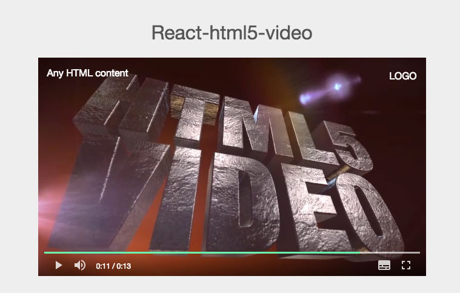

used by zexeo.com

##features:
 - simple & easy
 - custom video overlay content( any html content on top of video )

##TODO
 - UI for Fullscreen mode
 - ~~subtitle tracks~~
 - network error notification
 - loading spinner
 - custom menu for mouse right click 
 - register any event listener on parent component
 - playback rate change
 - select defferient resulution
 - use without browserify
 - complete tests

##install
```
npm install --save react-h5-video
```
load in the stylesheet,(in order to make it easier for developers to customize video player's style, css is not written in js)
```html
<link rel="stylesheet" type="text/css" href="node_modules/react-html5-video/lib/react-html5-video.css">
```
basic usage
```javascript
import React from "react";
import Video from "react-h5-video";

class MyAewsomeApp extends React.Component{
	render(){
		var sources = [ "./video/video.mp4","./video/video.webm","./video/video.ogv" ]
		return(
			<Video sources={sources} poster="./video/poster.png" >
				<h3 className="video-logo pull-right"><a href="http://glexe.com" target="_blank">LOGO</a></h3>
				<p>Any HTML content</p>
			</Video>
		)
	}
}
```
##props
```javascript
Video.propTypes = {
	metaDataLoaded: 		React.PropTypes.func,// video's meta data loaded callback
	

	// properties
	sources:		React.PropTypes.array,
	subtitles:		React.PropTypes.array, // [{src:"foo.vtt", label:"English",lang:"en" }]
	autoPlay: 		React.PropTypes.bool,
	controls:		React.PropTypes.bool,
	autoHideControls:		React.PropTypes.bool,
	controlPanelStyle:		React.PropTypes.oneOf(["overlay","fixed"]),
	preload:		React.PropTypes.oneOf(["auto","none","metadata"]), 
	loop:		React.PropTypes.bool,
	mute:		React.PropTypes.bool,
	poster:		React.PropTypes.string,
	width:		React.PropTypes.string,
	height:		React.PropTypes.string,
	volume:		React.PropTypes.number,
}
// here are all some default props
Video.defaultProps = {
	autoPlay:		false,
	loop:		false,
	controls:		true,
	autoHideControls:		true,
	volume:		1.0,
	mute:		false,
	controlPanelStyle:		"overlay",
	preload:		"auto",
}

```
###video meta data loaded callback
onece the meta data is loaded, you can get the info of this video(width,height,duration...etc), then you can use the returnd api to perform basic actions

the reutned api has throse property:
 - `$video` the html5 <video> DOM element,
 -	`fullscreen` function(), 
 -	`setTime` function( second )
 -	`togglePlay` function()
 -	`volume` function( mumber:0-1 )

```javascript
class App extends React.Component{
	loaded(api){
		this.videoApi = api;
		// console.log( api.$video.duration ) 
		// to toggle play state, just call this.videoApi.togglePlay()
	}
	render(){
		return(
			<Video sources={sources}  metaDataLoaded={this.loaded}/>
		)
	}
}
```


